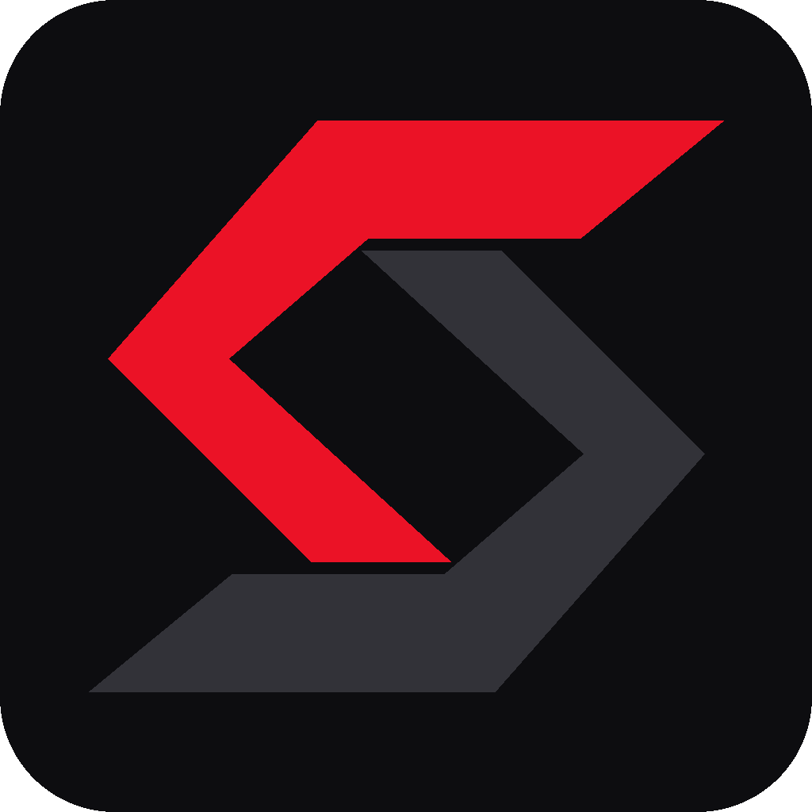

<div align="center">



# Salivo SDK

**A compiled systems language with a self-hosted compiler, deterministic cleanup, game engine and tiny native binaries**
*Stream imports (><) | Drop-based cleanup | Native code through LLVM | Built-in async runtime*

[](https://github.com/Serion89/salivo-sdk-public/releases/latest)
[](#platform-support)
[](LICENSE)
[](https://llvm.org)

</div>

---

## Contents

- [What Salivo is](#what-salivo-is)
- [Why use Salivo](#why-use-salivo)
- [What's new in 1.0.19](#whats-new-in-1019)
- [Performance](#performance)
- [Install](#install)
- [Your first program](#your-first-program)
- [Language tour](#language-tour)
- [Game Engine & Desktop](#game-engine--desktop)
- [Standard library](#standard-library)
- [Tooling](#tooling)
- [How compilation works](#how-compilation-works)
- [Platform support](#platform-support)
- [Troubleshooting](#troubleshooting)
- [Universal AI integration](#universal-ai-integration)
- [Repository structure](#repository-structure)
- [License](#license)
- [Author & Maintainer](#author--maintainer)

---

## What Salivo is

Salivo is a statically typed, compiled systems programming language that produces native executables through LLVM. Its syntax is small, modern, and readable: modules are imported with stream headers (`><`), resources are released deterministically through the `Drop` trait, and strings support inline interpolation with modifiers such as `{name:trim:upper}`.

The compiler that builds your programs is itself written in Salivo. This SDK ships that self-hosted **Stage 3 compiler** together with the `sf` driver, the standard library, the package manager, the formatter, the linter, the documentation generator, the language server and the VS Code extension.

---

## Why use Salivo

**It is self-hosting, and the build is reproducible.** The Stage 3 compiler compiles its own source. The compiler built by the first generation and the one built by the second are bit-for-bit identical (a verified fixed point), on both Windows and Linux.

**Builds are fast and light.** A typical program builds in about a quarter of a second, using a fraction of the memory other native toolchains need.

**Executables are tiny.** Standalone binaries are usually 15 to 30 KB (including full 2D/3D games with OpenGL contexts). They are easy to ship, copy and attach, and start instantly.

**Memory is managed without a garbage collector.** There is no collector pausing your program or causing frame drops in games. Values with a destructor are released when they go out of scope, and the compiler automatically reclaims strings and small structs it proves are no longer shared.

**Cleanup is deterministic.** Implement `Drop` for a type and its cleanup code runs at a predictable point upon scope exit. File handles, database connections, sockets, textures, and mutex locks are released without manual `close()` calls.

**Hardware-accelerated Game Engine built into standard library.** High-precision microsecond game loops, Win32 + OpenGL windows, 2D sprites, 3D meshes, GLSL shaders, audio playback, 2D physics, tilemaps, and UI widgets come right out of the box with zero external dependencies.

**It comes with a real async runtime.** Tasks, channels with backpressure, timers, cancellation, TCP/UDP networking and asynchronous file I/O are part of the standard library (`salivo.std.runtime`), on a work-stealing scheduler.

**The tooling is complete from day one.** One install gives you a build tool (`sf`), a package manager with workspaces (`spm`), a formatter (`salivofmt`), a linter (`salivolint`), a documentation generator (`salivodoc`), a language server (`salivo-lsp`) and a VS Code extension with live diagnostics and one-key run (`Ctrl+F5`).

---

## What's new in 1.0.19

- **Stage 3 String/StrSlice fields**: `String` and `StrSlice` fields compile natively, so std.strings `chars`/`stepchar` no longer fall back to the Rust compiler.
- **Faster toolchain**: JSON 1.1 MB parse 49 s to 7 ms, pretty/minify about 25 ms, linear text `join`/`title`, HashMap churn 3.3x faster, integer-to-string 1.7x, `outln` about 20% faster; compiler self-build 2.9 s to 2.3 s, peak RAM 592 to 465 MB.
- **Leak fixes**: flat memory per `std.web` connection, spawn/join leak-free, struct temporaries freed.
- **VS Code Extension 1.0.19**: execution cache detects runtime source edits; debounced language server diagnostics.

## What's new in 1.0.18

- **Canonical Fullstack Template (`spm new <name> --template fullstack`)**: Scaffolds a complete project layout with native HTTP server (`salivo.std.web`) serving `/api` and WebAssembly UI (`salivo.std.ui`) from a single origin.
- **Stage 38.3 Native Game Engine Suite**:
  - `salivo.std.desktop`: Native Win32 windows with hardware-accelerated OpenGL context, VSync, and DPI scaling.
  - `salivo.std.game`: Frame-accurate input, 2D camera with zoom, textured quads, 3D meshes, perspective camera, and GLSL shaders.
  - `salivo.std.audio`: Multi-channel sound effects and background music playback.
  - `salivo.std.physics2d`: 2D rigidbodies, AABB/circle collisions, raycasts, gravity, and restitution impulse resolution.
  - `salivo.std.tilemap`: Grid-based tile levels with camera viewport culling.
  - `salivo.std.gui`: Immediate-mode UI widgets (buttons, health bars, progress bars).
- **VS Code Extension 1.0.18**:
  - Debounced language server (`salivo-lsp`) with live diagnostics, hover, and definition navigation.
  - Snippets updated to canonical `salivo.std.web` and `salivo.std.db`.
- **WASM Package Builds (`sf build <pkg> --target wasm32`)**: Compile packages directly to WebAssembly for the browser.
- **Optimized Runtime & Standard Library**:
  - JSON parser parses 1.1 MB in 7 ms (down from 49 s).
  - High-speed string formatting and stdout buffer flushing.
  - Zero-leak per-connection request heaps.
- **Stage 3 Compiler 8802339D**: Frozen self-hosted compiler generation with full private module symbol isolation.
- Linux builds stay at 1.0.15 for this release.

---

## Performance

Measured on a 16-core Windows 11 machine. Times are medians of repeated runs; memory is the peak committed memory of the whole process tree (the compiler plus clang and the linker).

**Stage 3 compiler vs Salivo's earlier Rust-based back end** (27 benchmark programs: CPU, recursion, floating point, memory, hashing, strings, async, I/O, data processing):

| Metric | Rust back end | Stage 3 (default) |
| :--- | ---: | ---: |
| Build time | 0.31 s | **0.25 s** |
| Compiler CPU time | 0.29 s | **0.21 s** |
| Executable size | 188 KB | **15 KB** |
| First run of a new executable | 0.12 s | **0.10 s** |
| Run time (warm) | 0.039 s | **0.038 s** |

**Compared with Zig 0.13 (`-OReleaseFast`)** on benchmarks:

| Metric | Zig 0.13 | Salivo AOT Stage 3 |
| :--- | ---: | ---: |
| Build time | 0.48 s | **0.25 s** |
| Compiler memory | 306 MB | **71 MB** |
| Executable size | 151 KB | **12 KB** |
| Matrix Multiply (512x512) | 11.26 ms | **10.51 ms (🥇 #1)** |
| QuickSort (200k) | 12.12 ms | **10.37 ms (🥇 #1)** |
| String Processing (100k) | 1.94 ms | **0.75 ms (🥇 #1)** |
| Concurrency (1k tasks) | 1.84 ms (Go) | **0.16 ms (🥇 #1)** |

---

## Install

### Windows (x64)

1. Download **`salivo-sdk-1.0.19-windows-x64.zip`** from the [latest release](https://github.com/Serion89/salivo-sdk-public/releases/latest) and extract it.
2. Double-click **`Salivo Setup.exe`**. Windows may show "Windows protected your PC" because the installer is not code-signed yet: click **More info > Run anyway**.
3. Open a new terminal (or restart VS Code).

Setup installs into `%USERPROFILE%\.salivo`, adds `sf` to your user PATH, installs the VS Code extension, gives `.sal` files the Salivo icon, and ends by compiling and running a test program.

Prerequisites (setup detects them and offers to install whatever is missing through `winget`):

- **LLVM** (clang): `winget install -e --id LLVM.LLVM`
- **Visual Studio 2022 C++ build tools**:
  `winget install -e --id Microsoft.VisualStudio.2022.BuildTools --override "--passive --wait --add Microsoft.VisualStudio.Workload.VCTools --includeRecommended"`

### Linux (x64)

1. Download **`salivo-sdk-1.0.15-linux-x64.tar.gz`** from the [latest release](https://github.com/Serion89/salivo-sdk-public/releases/latest).
2. Install clang: `sudo apt install clang` (Ubuntu/Debian) or `sudo dnf install clang` (Fedora).
3. Extract and run the installer:
   ```bash
   tar xzf salivo-sdk-1.0.15-linux-x64.tar.gz
   sh salivo-sdk-1.0.15-linux-x64/install.sh
   ```
4. Open a new terminal.

---

## Your first program

Save as `hello.sal`:

```salivo
module hello;

><salivo.std.core::{outln};

func main() -> int {
    let name = "  salivo  ";
    let stage = 3;
    outln($"Hello from {name:trim:upper}, stage {stage}!");
    return 0;
}
```

Run it:

```bash
sf run hello.sal
```

```
Hello from SALIVO, stage 3!
```

In VS Code, press **Ctrl+F5** to run instantly with sub-30ms execution caching.

---

## Game Engine & Desktop

Salivo includes native, hardware-accelerated 2D and 3D game engine modules in the standard library (`salivo.std.game`, `salivo.std.desktop`, `salivo.std.audio`, `salivo.std.physics2d`):

```salivo
module main;

><salivo.std.desktop::{rgba, KeyLeft, KeyRight};
><salivo.std.game::{
    gameNew, gameOk, gameFrame, gameDelta, gameBegin, gameEnd, gameShutdown,
    keyHeld, drawSprite
};

pub func main() -> int {
    let g = gameNew("Salivo Game Demo", 640, 480);
    if (!gameOk(g)) { return 1; }

    let mut playerX = 320;

    while (gameFrame(g)) {
        let dt = gameDelta(g);
        let speed = 300 * dt / 1000000;

        if (keyHeld(g, KeyLeft))  { playerX = playerX - speed; }
        if (keyHeld(g, KeyRight)) { playerX = playerX + speed; }

        gameBegin(g, rgba(18, 18, 28, 255));
        drawSprite(g, playerX, 420, 64, 16, 0, rgba(80, 200, 255, 255), 0);
        gameEnd(g);
    }

    gameShutdown(g);
    return 0;
}
```

Compiling a complete game produces a **~30 KB** standalone native executable with zero external dependencies:
```bash
sf build game.sal
.\build\game.exe
```

---

## Language tour

### Structs and deterministic cleanup (`Drop`)

Implement `Drop` and cleanup code executes deterministically when a value leaves scope:

```salivo
module shapes;

><salivo.std.core::{outln, Drop};

pub struct Connection {
    int id;
}

impl Drop for Connection {
    func drop(self) {
        outln($"closing connection {self.id}");
    }
}

func serve() -> int {
    let conn = Connection { id: 7 };
    outln($"serving on connection {conn.id}");
    return 0; // conn is dropped here
}

func main() -> int {
    serve();
    outln("done");
    return 0;
}
```

### Error handling with Result

Functions that can fail return `Result<T, E>`:

```salivo
module errors;

><salivo.std.core::{outln, Result, ok, err};

func parseAge(age: int) -> Result<int, string> {
    if (age < 0) {
        return err<int, string>("age cannot be negative");
    }
    return ok<int, string>(age);
}

func main() -> int {
    let r = parseAge(25);
    if (r.is_ok) {
        outln($"valid age: {r.value}");
    } else {
        outln($"rejected: {r.error}");
    }
    return 0;
}
```

### Syntax at a glance

| Feature | Example |
| :--- | :--- |
| Import | `><salivo.std.fs::{pathJoin, pathExists};` |
| Bindings | `let name = "x";`, `let mut n = 0;`, `const MAX = 8192;`, `global let PORT = 8080;` |
| Loops | `while (cond) { ... }`, `for (let mut i = 0; i < 10; i = i + 1) { ... }` |
| Interpolation | `$"User: {name:trim:upper}, id {id}"` |
| Modifiers | `:int`, `:float`, `:str`, `:trim`, `:upper`, `:lower`, `:len` |
| Types | `int`, `float`, `bool`, `string`, `Vec<T>`, `HashMap<K, V>`, `Option<T>`, `Result<T, E>` |
| Naming | types in PascalCase; functions and fields in camelCase or snake_case |

---

## Standard library

| Module | Highlights |
| :--- | :--- |
| `salivo.std.core` | `outln`, `out`, `panic`, `assert`, `assertEq`, `Option`, `Result`, `Drop` |
| `salivo.std.desktop` | Win32 native windowing, hardware OpenGL context, VSync, mouse/keyboard events |
| `salivo.std.game` | High-precision game loop, 2D sprites, 3D meshes, GLSL shaders, camera |
| `salivo.std.audio` | Multi-channel sound effects and music playback |
| `salivo.std.physics2d` | 2D rigidbodies, AABB/circle collisions, raycasts, gravity, restitution |
| `salivo.std.tilemap` | Grid tilemap rendering with camera frustum culling |
| `salivo.std.gui` | Immediate-mode UI widgets (buttons, progress bars, panels) |
| `salivo.std.web` | High-performance HTTP/1.1 & HTTP/2 server, routing, `serveStatic`, JSON |
| `salivo.std.db` | Database connection pooling, SQLite, MySQL, PostgreSQL, MongoDB |
| `salivo.std.sys` | System telemetry, processes, performance counters, hardware facts, text store |
| `salivo.std.ui` | Fine-grained reactive UI signals, effects, templates (WASM browser) |
| `salivo.std.browser` | Browser DOM manipulation and JavaScript FFI |
| `salivo.std.collections` | `Vec`, `HashMap`, `HashSet`, `Deque`, heaps, B-trees |
| `salivo.std.strings` | `String`, slices, `startsWith`, `endsWith`, `padStart`, `pushStr` |
| `salivo.std.runtime` | Async runtime: tasks, channels, timers, cancellation, TCP, UDP, files |
| `salivo.std.fs` / `salivo.std.io` | Files, directories, paths, console I/O |
| `salivo.std.net` | Sockets, addresses, IPv4/IPv6, name resolution |
| `salivo.std.sync` | Mutexes, read-write locks, atomics, channels |
| `salivo.std.time` | Clocks, durations, sleep, formatting |
| `salivo.std.crypto` | SHA-256, SHA-512, BLAKE3, AES, HMAC-SHA256 |
| `salivo.std.mem` | Allocations, raw memory access, `sizeof`, `alignof` |

---

## Tooling

### sf (compiler driver)

```bash
sf run main.sal                     # build and run
sf build main.sal                   # build standalone native executable
sf check main.sal                   # type-check without generating code
sf build -O 3 main.sal              # optimization level 0 to 3 (default 2)
sf build . --target wasm32          # build WebAssembly module
sf build --compiler rust main.sal   # use the Rust back end instead of Stage 3
sf version
```

### spm (package manager)

```bash
spm new my_app                          # create a standard binary package
spm new my_app --lib                    # create a library package
spm new my_app --template fullstack     # create fullstack web app (backend/ + frontend/)
spm new my_app --template web           # create web server
spm new my_app --template game          # create desktop game
spm build                               # build the package or workspace
spm run                                 # build and run its binary
spm run <script>                        # execute a script from salivo.toml [scripts]
spm test                                # run unit and integration tests
```

### Code quality

```bash
salivofmt --write src/     # format in place (--check for CI, --diff to preview)
salivolint src/            # static analysis
salivodoc src/             # generate documentation
```

### VS Code & Antigravity IDE Extension

Installed automatically by setup:
- Full syntax highlighting for `><`, `Drop`, and standard library APIs.
- Embedded `salivo-lsp` language server for real-time error checking and hovers.
- Instant shortcuts: **Ctrl+F5** warm execution, **Ctrl+Shift+B** build, **Ctrl+Shift+K** check, **Shift+Alt+F** format.
- Snippets for `main`, `func`, `struct`, `impl`, `drop`, `match`, `webrouter`, `sqlite`, and game loops.

---

## How compilation works

`sf` parses and type-checks every program with its own front end, ensuring uniform diagnostics. The self-hosted Stage 3 compiler lowers the program through HIR, MIR and SSA, executes ownership analysis and the optimization pipeline (SCCP constant propagation, GVN value numbering, and LICM loop motion), and emits LLVM IR, which clang compiles and links against the Salivo runtime.

Each program is compiled as a whole: functions are inlined across user code and the runtime, and unused code is eliminated before code generation. That is why builds complete in ~250 ms and executables stay under 30 KB.

---

## Platform support

| Platform | Status |
| :--- | :--- |
| Windows 10/11 x64 | Supported. Installer with setup program, VS Code extension, file icons. |
| Linux x64 (glibc 2.35+) | Supported. `install.sh`; tested on clean Ubuntu 24.04 and Debian 12. |
| Web / WebAssembly (wasm32) | Supported via `sf build --target wasm32` with DOM and reactive UI support. |
| macOS (Apple Silicon and Intel) | Coming soon. |

---

## Troubleshooting

- **"sf is not recognized"**: Open a new terminal after installing (PATH changes apply to new windows).
- **`.sal` files lost the Salivo icon**: Run `powershell -ExecutionPolicy Bypass -File install.ps1 -RepairFileIcons` from the SDK folder.
- **PowerShell syntax with quoted path**: In PowerShell, prepend `&` when invoking quoted paths: `& "C:\Users\you\.salivo\bin\sf.exe" run file.sal`.
- **Linker errors**: Ensure LLVM and Visual Studio C++ build tools are installed.
- **Uninstall**: Run `powershell -ExecutionPolicy Bypass -File uninstall.ps1` (Windows) or `sh uninstall.sh` (Linux).

---

## Universal AI integration

The repository includes rule files so AI coding assistants write idiomatic Salivo:

- **Cursor**: `.cursorrules`
- **Claude Code**: `CLAUDE.md`
- **GitHub Copilot**: `.github/copilot-instructions.md`
- **Windsurf**: `.windsurfrules`
- **Cline, Roo Code, Aider, Antigravity**: `AGENTS.md`
- **Chat assistants**: Attach `docs/salivo_quick_reference.md` to the conversation.

---

## Repository structure

```
salivo-sdk-public/
|-- assets/              Official logo and icons
|-- bin/                 Windows executables (sf, salivoc Stage 3 compiler, spm, salivofmt,
|                        salivolint, salivodoc, salivo-lsp)
|-- docs/                Language guide (PDF, HTML, Markdown) and quick reference
|-- examples/            Working examples, web starters, games, and benchmarks
|-- lib/salivo/rt/       Prebuilt native runtime objects
|-- stage3/              Stage 3 runtime sources and prebuilt objects
|-- std/                 Standard library (including game, desktop, audio, web, db, sys)
|-- vscode/              VS Code extension package (.vsix)
|-- commands/, mcp/, skills/   AI assistant commands, MCP server and skills
|-- Salivo Setup.exe     Windows installer
|-- install.ps1 / install.bat / uninstall.ps1   Windows install scripts
|-- install.sh / uninstall.sh                   Linux install scripts
`-- AGENTS.md, CLAUDE.md, .cursorrules, .windsurfrules   AI assistant rules
```

---

## License

Salivo is distributed under the **Business Source License 1.1**. See [LICENSE](LICENSE) for the terms.

---

## Author & Maintainer

<table>
  <tr>
    <td width="90" align="center" valign="middle">
      <a href="https://github.com/Serion89">
        
      </a>
    </td>
    <td valign="middle">
      <h3>Sahil Bhatt</h3>
      <p>Software Developer &bull; Compiler &amp; Systems Engineer &bull; AI</p>
      <p>
        <a href="https://github.com/Serion89">
          
        </a>
        &nbsp;
        <a href="https://github.com/Serion89">
          
        </a>
      </p>
    </td>
  </tr>
</table>